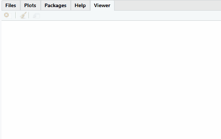

<!-- README.md is generated from README.Rmd. Please edit that file -->

```{r, include = FALSE}
knitr::opts_chunk$set(
  collapse = TRUE,
  comment = "#>",
  fig.path = "man/figures/README-",
  out.width = "100%"
)
```


# mailmerge 

<!-- badges: start -->
[](https://github.com/andrie/mailmerge/actions)
[](https://travis-ci.org/andrie/mailmerge)
[](https://codecov.io/gh/andrie/mailmerge?branch=master)
[](https://lifecycle.r-lib.org/articles/stages.html#experimental)
<!-- badges: end -->


```{r child="man/fragments/intro_text.Rmd"}
```


## Installation

Install the package from CRAN:

```r
install.packages("mailmerge")
```

Install the dev version from https://github.com/andrie/mailmerge

```r
remotes::install_github("andrie/mailmerge")
```

## Setup

At the moment only gmail is supported as the email back-end, using the `gmailr` package (https://github.com/r-lib/gmailr).

Before you use `mail_merge()` it's important to authenticate against the gmail service, and you should use `gmailr::gm_auth()` to do this.

## Example

```{r child="man/fragments/intro_example.Rmd"}
```


<center>
```{r, echo=FALSE, out.width="80%"}

```
</center>
